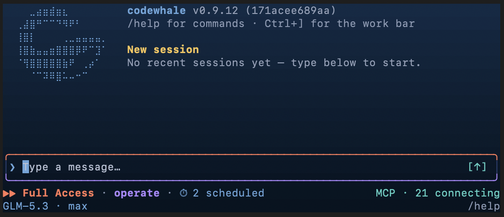

<!-- source: README.md sha256:330cff827493 -->
# Codewhale

Codewhale وكيل مفتوح المصدر يساعدك على تطوير البرامج والعمل على ملفاتك وأتمتة المهام اليومية باستخدام النماذج التي تختارها. ابدأ بمهمة في الطرفية، ثم اتصل بنموذج مستضاف أو محلي. وعندما تريد توزيع عمل أكبر على نماذج وأدوار مختلفة، يمكنك الاستعانة بفريق من الوكلاء.



[English](README.md) · [简体中文](README.zh-CN.md) · [日本語](README.ja-JP.md) · [Tiếng Việt](README.vi.md) · [Bahasa Indonesia](README.id.md) · [한국어](README.ko-KR.md) · [Español](README.es-419.md) · [Português](README.pt-BR.md) · [Русский](README.ru.md) · [Українська](README.uk.md) · [Français](README.fr.md) · [Deutsch](README.de.md) · [繁體中文](README.zh-TW.md) · [हिन्दी](README.hi.md) · [Türkçe](README.tr.md) · [Italiano](README.it.md) · [Polski](README.pl.md) · [Català](README.ca.md)

[](https://github.com/Hmbown/CodeWhale/actions/workflows/ci.yml)
[](https://crates.io/crates/codewhale-cli)
[](https://www.npmjs.com/package/codewhale)
[](https://discord.gg/37gfS3ksug)

## التثبيت

للتثبيت الجديد على macOS أو Linux، استخدم الإصدار الرسمي من GitHub:

```bash
curl -fsSL https://codewhale.net/install.sh | sh
"$HOME/.local/bin/codewhale"
```

على Windows، نزّل المثبّت أو الأرشيف المناسب من [GitHub Releases](https://github.com/Hmbown/CodeWhale/releases/latest). لتحديث تثبيت مباشر موجود، شغّل `codewhale update`، أو `codewhale update --check` للفحص فقط. يعرض المحدّث مسار الملف التنفيذي ويحتفظ بالبنيات الأحدث. npm وCargo خياران ثانويان؛ راجع [دليل التثبيت](docs/INSTALL.md) للانتقال من تثبيت يديره مدير حزم وإعداد PATH.

يساعدك Codewhale عند التشغيل الأول على الاتصال بموفّر أو البقاء دون اتصال. ويدعم أيضًا Cargo وDocker وNix وScoop والأرشيفات المبنية مسبقًا وAndroid/Termux ومرآة CNB. راجع [دليل التثبيت](docs/INSTALL.md).

يمكن تفعيل الإكمال بمفتاح Tab بأمر واحد لكل واجهة أوامر — `codewhale completion bash|zsh|fish|powershell|elvish`. راجع [إكمال واجهة الأوامر](docs/INSTALL.md#8-shell-completions).

## الاستخدام

تحدث إلى Codewhale كما تتحدث إلى زميل في فريقك:

```text
Fix the failing tests and explain what changed.
```

أو شغّل مهمة من دون فتح واجهة TUI:

```bash
codewhale exec "fix the failing tests and explain what changed"
```

يستطيع Codewhale قراءة مستودعك وتعديل الملفات وتشغيل الأوامر وفحص النتائج ومواصلة العمل نحو هدف. وأنت من يقرر مقدار الوصول الذي تمنحه له.

## الواجهة الرسومية

هل تفضّل واجهة رسومية؟ إضافة CodeWhale for VS Code التي يحافظ عليها المجتمع تضع العميل نفسه في الشريط الجانبي لبرنامج VS Code — الدردشة والمحادثات المتسلسلة والفرق المباشرة وإدارة المهام، كل ذلك عبر نفس Runtime API، وتبقى الجلسات متزامنة مع الطرفية. ثبّتها من [سوق VS Code](https://marketplace.visualstudio.com/items?itemName=HengQuWorld.brotherwhale-vscode)؛ المصدر على [GitHub](https://github.com/HengQuWorld/CodeWhale-VSCode).

## لماذا Codewhale

- **اختر نماذجك.** اتصل بموفّرين مستضافين أو بنماذج محلية عبر Ollama أو vLLM أو SGLang. استخدم `/provider` لتغيير الموفّر و`/model` لاختيار نموذج.
- **ابقَ مسيطرًا.** وضع Plan للقراءة فقط. تجعل أوضاع Ask وAuto-Review وFull Access سلوك الموافقة واضحًا. يتراجع `/undo` عن الجولة الأخيرة، ويعيد `/restore` مساحة العمل إلى لقطة سابقة.
- **حافظ على تنظيم الأعمال الطويلة.** احفظ الجلسات، وحدد `/goal` دائمًا، وراجع مسارات العمل قبل تشغيلها، ونسّق بين الوكلاء من دون تحويل تعليماتهم الداخلية إلى جزء من محادثتك.
- **وسّع الوكيل الذي لديك بالفعل.** صِل خوادم MCP والمهارات، واضبط الخطافات، واحتفظ بأدوار الوكلاء كملفات مقروءة في مشروعك أو إعداداتك الشخصية.

شغّل `/help` في واجهة TUI لعرض الأوامر واختصارات لوحة المفاتيح.

## الأمان

يعمل Codewhale على جهازك بصلاحيات الوصول التي تمنحها له. تحد أوضاع الموافقة وقواعد المستودع مما يمكن للوكيل فعله؛ ويضيف عزل نظام التشغيل الاختياري حدًا أقوى للتنفيذ حيثما كان مدعومًا. تظل أسعار النماذج غير المعروفة مسجلة على أنها غير معروفة بدلًا من الإبلاغ عنها كمجانية.

اقرأ [ترتيب التفويض](docs/AUTHORIZATION_ORDER.md) لمعرفة التسلسل الدقيق للسياسات، و[الإعدادات](docs/CONFIGURATION.md) لمعرفة الضبط المحلي.

## الوثائق

- [الموفّرون والنماذج المحلية](docs/PROVIDERS.md)
- [فرق الوكلاء](docs/FLEET.md)
- [MCP](docs/MCP.md) و[الخطافات](docs/HOOKS.md) و[الإعدادات](docs/CONFIGURATION.md)
- [عميل الويب المحلي](docs/WEB.md)
- [جميع الوثائق](docs)
- [بنية المستودع ودليل المساهمة](CONTRIBUTING.md#project-structure)

## انضم إلى المجتمع

**نرحب بتقارير الأخطاء وأفكار الميزات وطلبات السحب**، سواء كنت تستخدم Codewhale منذ أشهر أو تجربه للمرة الأولى. إذا كان أحد الموفّرين غير متاح، أو كان مسار العمل غير مريح، أو كانت واجهة الطرفية تعيقك، [فافتح issue](https://github.com/Hmbown/CodeWhale/issues/new/choose) أو [أرسل pull request](CONTRIBUTING.md) لنحسّنه معًا. نرحب بالمساهمات الأولى، ويظل كل مساهم منسوبًا إلى العمل الذي يُدمج في المشروع.

انضم إلى [Discord](https://discord.gg/37gfS3ksug)، أو أضف Hunter على WeChat (`hunterbown`) واطلب الانضمام إلى مجموعة Whale Brothers.

## تاريخ المشروع

بدأ Codewhale باسم `deepseek-tui`، ولا يزال يحافظ على التوافق مع إعداداته وجلساته. وهو الآن محايد تجاه الموفّرين ويُصان بصورة مستقلة ولا ينتمي إلى أي موفّر نماذج.

شكرًا لكل مساهم ولمجتمعات المصادر المفتوحة التي ساعدت المشروع على النمو. راجع [سجل المساهمين](docs/CONTRIBUTORS.md).

## الترخيص

[MIT](LICENSE). الأجزاء المقتبسة والمعدّلة من مشاريع أخرى مفتوحة المصدر مسجّلة في [إشعارات الجهات الخارجية](docs/THIRD_PARTY_NOTICES.md).
