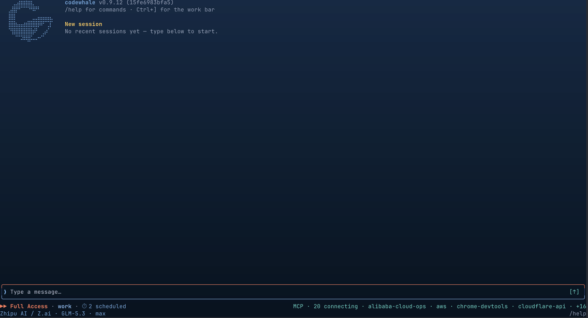

<!-- source: README.md sha256:1f5bf984e975 -->
# Codewhale

Агент для програмування з відкритим кодом у вашому терміналі — модель приносите ви.

Codewhale починався як нативний інструмент для DeepSeek. Відтоді він виріс у
проєкт, яким керує спільнота: єдине середовище для програмування, яке підходить
міжнародній спільноті, що зростає, і підтримує якнайбільше моделей та
провайдерів — відкриті моделі насамперед, хмарні чи локальні, жодна не має
переваги перед іншими.

Дайте йому провайдера, модель і завдання. Він читає ваш код, редагує файли,
виконує команди й перевіряє власну роботу, а потім зупиняється, коли робота
завершена або коли йому потрібні ви. Перемикайте моделі в розпалі завдання
командою `/model`. Працюйте інтерактивно в TUI або запускайте `codewhale exec`
у скриптах і CI. Він написаний на Rust, поширюється за ліцензією MIT і працює
на вашому комп'ютері.

Чого немає в інших харнесах: **модель для кожної ролі обираєте ви — і вони
не мусять збігатися** — і **агенти в Codewhale спілкуються між собою, через
моделі.** Fleet закріплює провайдера, модель і рівень міркувань за кожною
роллю, тож дешева швидка модель може керувати дорогою міркувальною, а
builder на GLM може робити те саме завдання, що й reviewer на Kimi. Поки
вони працюють, можна надіслати будь-кому з них нотатку просто в польоті,
зазирнути в його transcript або перервати його — і це не лише
«батько–дитина»: окремі задачі Codewhale в одному workspace обмінюються
міцним Agent Mail, який переживає перезапуск, доставляється рівно один раз
на безпечній межі та маскує облікові дані. `/goal` тримає довгу мету через
багато ходів, доки вона справді не завершена. Ролі — це файли, які ви
редагуєте, і весь харнес лишається вашим.

Ми завжди шукаємо учасників і способи стати кращими. Якщо моделі чи
провайдера, якими ви користуєтесь, бракує, або щось ламається, повідомити про
це — одна з найкорисніших речей, які ви можете зробити — див.
[Участь у проєкті](#участь-у-проєкті).

[English](README.md) · [简体中文](README.zh-CN.md) · [日本語](README.ja-JP.md) · [Tiếng Việt](README.vi.md) · [Bahasa Indonesia](README.id.md) · [한국어](README.ko-KR.md) · [Español](README.es-419.md) · [Português](README.pt-BR.md) · [Русский](README.ru.md) · [Français](README.fr.md) · [Deutsch](README.de.md) · [繁體中文](README.zh-TW.md) · [हिन्दी](README.hi.md) · [Türkçe](README.tr.md) · [Italiano](README.it.md) · [Polski](README.pl.md) · [العربية](README.ar.md) · [Català](README.ca.md) · [codewhale.net](https://codewhale.net/) · [Документація](docs) · [Журнал змін](CHANGELOG.md) · [Discord](https://discord.gg/37gfS3ksug)

[](https://github.com/Hmbown/CodeWhale/actions/workflows/ci.yml)
[](https://crates.io/crates/codewhale-cli)
[](https://www.npmjs.com/package/codewhale)
[](https://discord.gg/37gfS3ksug)



## Встановлення

```bash
npm install -g codewhale
```

Cargo, Docker, Nix, Scoop, готові архіви, Android/Termux, а також дзеркало CNB
для тих, хто не може отримати доступ до GitHub, описані в
[docs/INSTALL.md](docs/INSTALL.md). Переходите з `deepseek-tui`? Ваші
налаштування й сесії переносяться — див. [docs/REBRAND.md](docs/REBRAND.md).

## Використання

```bash
codewhale auth set --provider deepseek   # or export ANTHROPIC_API_KEY, etc.
codewhale                                # open the TUI
codewhale exec "fix the failing test"    # headless
codewhale web                            # local browser client on 127.0.0.1
```


У TUI: `/model` перемикає провайдера й модель разом, `/fleet` запускає команду
працівників, `/undo` скасовує останній крок, а `/restore <N>` відкочує робочу
копію до давнішого знімка (`/restore` без аргументу лише виводить їхній
список). Коли поле введення порожнє, `Tab` циклічно перемикає Plan / Work /
Operate; якщо в полі є текст, `Tab` доповнює слеш-команди та згадки `@`.
`Shift+Tab` перемикає режими дозволів Ask / Auto-Review / Full Access будь-коли.
`!` виконує команду оболонки через звичайний шлях затвердження.

## Що він уміє

- **Будь-яка модель, будь-який провайдер.** DeepSeek, Claude, GPT, Kimi, GLM та
  понад 30 провайдерів, а також власні vLLM, SGLang чи Ollama без жодного
  ключа — усе через одне середовище виконання й один набір інструментів. Каталог
  стежить за актуальним складом кожного провайдера: бекенд DeepSeek V4 Pro (з
  позначкою `DeepSeek-V4-Pro-0813`) надалі викликається як `deepseek-v4-pro`,
  Grok 4.6 — модель за замовчуванням для прямого маршруту xAI, а OrcaRouter
  маршрутизує через `orcarouter/auto`. Ліміти контексту й ціни беруться з реального маршруту, а невідома ціна показується
  як невідома, а не як $0.
- **Агенти, які спілкуються між собою — через моделі.** Кожен агент у
  Codewhale доступний, поки працює: `message` ставить нотатку в чергу
  працюючому сабагенту, `followup` будить його з вашою нотаткою на наступній
  безпечній межі, `peek` читає його transcript, а переривання зупиняє лише
  його хід. Це виходить за межі дерева «батько–дитина»: окремі задачі в
  одному workspace обмінюються міцним **Agent Mail** — поставлене в чергу
  резюме-передача, яке переживає перезапуск, доставляється рівно один раз на
  безпечній межі одержувача та маскує облікові дані і шляхи. Так сесія на
  GLM і сесія на Kimi координуються у двох терміналах, а ви випадаєте з ролі
  ретранслятора. Сторони можуть бути на різних моделях; Codewhale донесе
  розмову.
- **Harness, який пишете ви.** Ролі — це файли, які можна прочитати й змінити:
  для кожної ролі своя модель, своя позиція щодо інструментів і постійні
  інструкції. Тримайте їх у проєкті, щоб ними користувалася команда, або поруч з
  особистими налаштуваннями, щоб вони йшли за вами між репозиторіями.
  Constitution фіксує, як ви хочете, щоб агент поводився в кожній сесії, — тож
  harness підлаштовується під вашу практику, а не під нашу.
- **Робота, яку можна продовжити.** Fleet записує кожен крок у append-only
  журнал, і `fleet resume` продовжує з місця зупинки. `/goal` тримає стійку
  мету, до якої агент іде хід за ходом — її можна поставити на паузу,
  відновити, і вона відновлюється разом із сесією після перезапуску, — а
  `/workflows` відкриває живу панель усіх запусків, які зберігає журнал
  цього workspace.
- **Робота, яку можна відновити.** Флот записує кожен крок до журналу, що лише
  доповнюється, тож `fleet resume` підхоплює роботу з місця, де ви зупинились.

## Інтеграції

- **DeepSeek Harness (dsh) — підключається через Codewhale.**
  `codewhale integrations dsh connect` зв'язує наявну інсталяцію
  `@deepseek-ai/dsh` з вашим маршрутом провайдера, дозволами та робочою
  областю Codewhale; `integrations dsh install-bundle` додає опціональний
  бандл-плагін DSH, щоб `dsh --profile codewhale` ніс цю ідентичність
  самостійно. Дозволи та життєвий цикл лишаються за Codewhale; сесії,
  профілі та облікові дані dsh не зачіпаються. Див.
  [docs/INTEGRATIONS_DSH.md](docs/INTEGRATIONS_DSH.md).
- **VS Code.** Офіційний каркас розширення (`extensions/vscode`) відкриває
  Codewhale у вбудованому терміналі та дає Agent View лише для читання
  поверх локального рантайму. Це прев'ю для локальної розробки, а не реліз
  у маркетплейсі.

## Дізнатися більше

- [docs/PROVIDERS.md](docs/PROVIDERS.md) — кожен маршрут провайдера: хмарний,
  шлюзовий і локальний
- [docs/FLEET.md](docs/FLEET.md) — флоти, журнал і відновлення
- [docs/WORKFLOW_EXPERIMENTAL_SEARCH.md](docs/WORKFLOW_EXPERIMENTAL_SEARCH.md) — заморожений, нейтральний до провайдерів експериментальний пошук у Workflow
- [docs/CONFIGURATION.md](docs/CONFIGURATION.md) — `config.toml`, хуки й
  конституція
- [docs/AUTHORIZATION_ORDER.md](docs/AUTHORIZATION_ORDER.md) — як поєднуються
  режими, хуки, правила дозволів, мінімальні вимоги безпеки, правила репозиторію,
  затвердження та пісочниця
- [docs/HOOKS.md](docs/HOOKS.md) — одинадцять подій хуків життєвого циклу TUI,
  їхні корисні навантаження та три з них, що можуть скеровувати хід (`codewhale
  exec` і підкоманди CLI хуків не запускають)
- [docs/WEB.md](docs/WEB.md) — браузерний клієнт, доступний лише через
  loopback, і його межа одноразової автентифікації

Усе решта — режими, комбінації клавіш, деталі пісочниці, MCP, API середовища
виконання й архітектура — знаходиться в [docs](docs) і на
[codewhale.net](https://codewhale.net/).

## Участь у проєкті

Звіти про проблеми, PR, кроки відтворення, журнали й побажання щодо функцій —
усе це справжня робота над проєктом, і перші внески вітаються. Коли PR не можна
злити як є, супровідники забирають те, що працює, і зберігають авторство — у
коміті, в журналі змін і в [docs/CONTRIBUTORS.md](docs/CONTRIBUTORS.md).

- [Відкриті issues](https://github.com/Hmbown/CodeWhale/issues) — тут живуть
  хороші перші внески
- [CONTRIBUTING.md](CONTRIBUTING.md) — налаштування середовища розробки й
  процес PR
- [docs/CONTRIBUTORS.md](docs/CONTRIBUTORS.md) — усі, хто сформував цей проєкт
- [Buy me a coffee](https://www.buymeacoffee.com/hmbown)

Дякуємо [DeepSeek](https://github.com/deepseek-ai) за моделі й підтримку, з
яких почався проєкт, [DataWhale](https://github.com/datawhalechina) 🐋 за те,
що прийняли нас у родину Китових Братів, а також
[OpenWarp](https://github.com/zerx-lab/warp) і
[Open Design](https://github.com/nexu-io/open-design) за співпрацю над досвідом
термінального агента.

## Ліцензія

[MIT](LICENSE). Незалежний проєкт спільноти, не пов'язаний із жодним
провайдером моделей.


[](https://star-history.dera.page/#Hmbown/CodeWhale&type=date)
